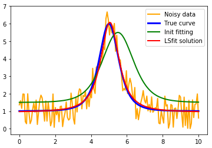
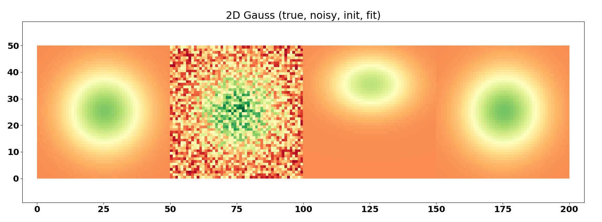

# LSfit library
Parametric least-square fitting.

Created in January 2018
Updated on June 16th, 2018

I provide my code here if you need it, however be aware that you might find better fitting libraries on GitHub!!! You can send your questions or your comments on https://groups.google.com/d/forum/lsfit

### LSfit
Fitting method using Levenberg-Marquardt algorithm.

### newton
Newton's algorithm, to find the solution of f(X)=0

### Usual_functions
Some functions you may need for fitting, such as Gaussian and Moffat (both in 1D and 2D)

### LSfit_example_***
Test files. Feel free to use them to handle LSfit

---

## Example
We want to retrieve a function (blue) describing a physical process. However the observed data (yellow) is corrupted with noise. The user provides a first estimate (green) of the function, and LSfit returns the least square fitting (red) that best matches the function.

## Example 2D
Here is an example in 2D, using a Gaussian function. From left to right: true function, noisy observed data, user guess, LSfit2D solution.

